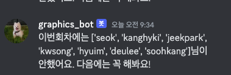

<!-- PROJECT SHIELDS -->
<!--
*** I'm using markdown "reference style" links for readability.
*** Reference links are enclosed in brackets [ ] instead of parentheses ( ).
*** See the bottom of this document for the declaration of the reference variables
*** for contributors-url, forks-url, etc. This is an optional, concise syntax you may use.
*** https://www.markdownguide.org/basic-syntax/#reference-style-links
-->


<!-- PROJECT LOGO -->
<br />
<div align="center">
  <a href="https://github.com/42Seoul-Graphics/discord_bot">
    
  </a>

  <h3 align="center">42 graphics study bot</h3>

  <p align="center">
    스터디 관리 자동화를 위한 디스코드 봇
    <br />
    <a href="https://github.com/42Seoul-Graphics/discord_bot"><strong>Explore project »</strong></a>
    <br />
    <br />
</div>


<!-- ABOUT THE PROJECT -->
## About The Project



스터디 관리를 자동화를 위한 디스코드 봇,
2주에 한번 씩 스터디 과제를 안 한 인원 체크 후 알림

### How to check umcompleted memebers

- [제출레포](https://github.com/42Seoul-Graphics/record)에 자신의 폴더에 파일 제출
- 스터디 봇은 2주안에 자신의 폴더안에 깃 커밋이 있는지로 판단
- 깃커밋 시간을 기준으로 판단됨


<!-- USAGE EXAMPLES -->
## Usage

```shell
> pip3 install -r requirements.txt
> python3 src/main.py
```


<p align="right">(<a href="#readme-top">back to top</a>)</p>
